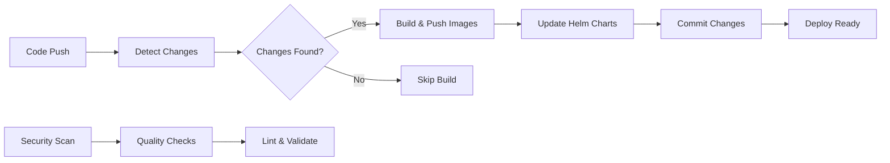

# 🚀 Retail Store CI/CD Pipeline

This repository contains a complete CI/CD pipeline for the retail store microservices application using GitHub Actions, Docker, Amazon ECR, and Helm.

## 📁 Generated Files

The following files have been created to support your CI/CD pipeline:

```
.github/
├── workflows/
│   ├── ci-cd.yml              # Main CI/CD pipeline
│   ├── security-quality.yml   # Security scanning and code quality
│   ├── setup-ecr.sh          # ECR repositories setup script
│   └── README.md             # Detailed workflow documentation
└── .yamllint.yml             # YAML linting configuration
```

## 🎯 Main CI/CD Pipeline Features

### 1. 🔍 Intelligent Change Detection

- Automatically detects which services have been modified
- Only builds and deploys changed services
- Supports manual trigger to build all services

### 2. 🐳 Docker Build & Push

- Builds Docker images for modified services
- Pushes to Amazon ECR with proper tagging
- Uses GitHub Actions cache for faster builds
- Multi-platform support (linux/amd64)

### 3. 📝 Helm Chart Updates

- Automatically updates `values.yaml` files with new image tags
- Changes repository from public ECR to your private ECR
- Commits changes back to repository (main branch only)
- Shows changes in PR summaries without committing

### 4. 🔒 Security & Quality Checks

- Vulnerability scanning with Trivy
- Dockerfile linting with Hadolint
- YAML linting
- Helm chart validation
- Dependency scanning

## 🏗️ Supported Services

| Service      | Language           | Port | Description                |
| ------------ | ------------------ | ---- | -------------------------- |
| **UI**       | Java (Spring Boot) | 8080 | Frontend web application   |
| **Catalog**  | Go                 | 8080 | Product catalog API        |
| **Cart**     | Java (Spring Boot) | 8080 | Shopping cart API          |
| **Checkout** | Node.js            | 8080 | Checkout orchestration API |
| **Orders**   | Java (Spring Boot) | 8080 | Order management API       |

## 🚀 Quick Start

### 1. Set up ECR Repositories

Run the provided script to create ECR repositories:

```bash
cd .github/workflows
chmod +x setup-ecr.sh
./setup-ecr.sh
```

### 2. Configure GitHub Secrets

Add these secrets to your GitHub repository:

| Secret Name             | Description                 | Example                                        |
| ----------------------- | --------------------------- | ---------------------------------------------- |
| `AWS_ACCESS_KEY_ID`     | AWS Access Key              | `AKIA...`                                      |
| `AWS_SECRET_ACCESS_KEY` | AWS Secret Key              | `wJalrXUt...`                                  |
| `ECR_REGISTRY`          | ECR Registry URL            | `123456789012.dkr.ecr.us-east-1.amazonaws.com` |
| `SONAR_TOKEN`           | SonarCloud token (optional) | `sqp_...`                                      |

### 3. Update Configuration

Edit `.github/workflows/ci-cd.yml` if needed:

```yaml
env:
  AWS_REGION: us-east-1 # Change to your region
  ECR_REGISTRY: ${{ secrets.ECR_REGISTRY }}
```

### 4. Test the Pipeline

1. Make a change to any service in `src/`
2. Push to main branch or create a PR
3. Watch the pipeline run automatically

## 🔄 Pipeline Workflow



## 🏷️ Image Tagging Strategy

| Trigger      | Tag Format                 | Example             |
| ------------ | -------------------------- | ------------------- |
| Push to main | `<commit-sha>`             | `abc123ef456`       |
| Pull Request | `pr-<number>-<commit-sha>` | `pr-42-abc123ef456` |
| All builds   | `latest`                   | `latest`            |

## 🎯 Change Detection Logic

The pipeline uses intelligent path-based detection:

```yaml
ui: ["src/ui/**"]
catalog: ["src/catalog/**"]
cart: ["src/cart/**"]
checkout: ["src/checkout/**"]
orders: ["src/orders/**"]
```

Only services with actual code changes will be processed.

## 🔒 Security Features

- **Container Scanning**: Trivy scans for vulnerabilities
- **Dockerfile Linting**: Hadolint ensures best practices
- **Dependency Scanning**: Checks for vulnerable dependencies
- **SARIF Reports**: Integration with GitHub Security tab
- **Weekly Scans**: Automated security scans

## 📊 Quality Assurance

- **Helm Validation**: Charts are linted and tested
- **YAML Linting**: Consistent formatting
- **Code Quality**: SonarCloud integration (optional)
- **Multi-language Support**: Java, Go, Node.js

## 🚀 Deployment Integration

### ArgoCD Integration

The pipeline works seamlessly with ArgoCD:

1. Pipeline updates Helm charts
2. ArgoCD detects changes
3. Applications auto-deploy

### Manual Deployment

Use updated image tags for manual deployment:

```bash
helm upgrade ui src/ui/chart/ --set image.tag=<new-tag>
```

## 🔧 Troubleshooting

### Common Issues

1. **ECR Permission Denied**

   ```bash
   # Check AWS credentials
   aws sts get-caller-identity

   # Verify ECR permissions
   aws ecr describe-repositories
   ```

2. **Build Failures**

   - Check Dockerfile syntax
   - Verify build context
   - Review build logs

3. **Helm Chart Issues**
   ```bash
   # Validate locally
   helm lint src/ui/chart/
   helm template test src/ui/chart/
   ```

### Debug Mode

Enable debug logging:

```bash
# Add to repository secrets
ACTIONS_STEP_DEBUG: true
```

## 🌟 Best Practices Implemented

✅ **Multi-service monorepo support**  
✅ **Intelligent change detection**  
✅ **Secure credential handling**  
✅ **Efficient Docker caching**  
✅ **Automated security scanning**  
✅ **GitOps-ready workflow**  
✅ **Comprehensive documentation**  
✅ **Error handling and reporting**

## 📈 Monitoring & Observability

The pipeline provides:

- **Build summaries** with detailed information
- **Security scan results** in GitHub Security tab
- **Deployment status** in Actions tab
- **Artifact tracking** with image tags

## 🔗 Related Documentation

- [Workflow Details](.github/workflows/README.md)
- [BRANCHING_STRATEGY.md](../BRANCHING_STRATEGY.md)
- [ArgoCD Applications](../argocd/)
- [Service Documentation](../src/)

## 📞 Support

For issues with the CI/CD pipeline:

1. Check the [troubleshooting guide](#troubleshooting)
2. Review workflow logs in GitHub Actions
3. Validate your AWS and GitHub configurations

---

**🎉 Your CI/CD pipeline is ready!** Push some code changes to see it in action.
